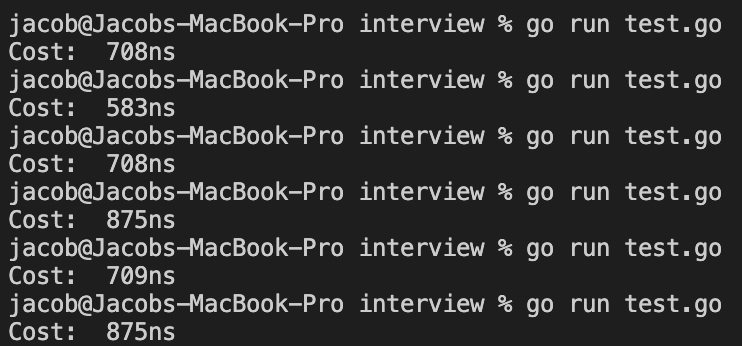

# 1. Analysis of Complexion - 复杂度分析

- [1. Analysis of Complexion - 复杂度分析](#1-analysis-of-complexion---复杂度分析)
  - [Go - 复杂度分析的意义](#go---复杂度分析的意义)
  - [Go - 大 O 复杂度表示法](#go---大-o-复杂度表示法)
  - [Go - 时空复杂度](#go---时空复杂度)
    - [Go - 时间复杂度](#go---时间复杂度)
    - [Go - 空间复杂度](#go---空间复杂度)
  - [Go - 常见的复杂度量级](#go---常见的复杂度量级)
  - [Go - 时间复杂度分析](#go---时间复杂度分析)

在学习完数据结构之后，相信你能感受到特定环境下，特定数据结构带来的高效性

算法和数据结构也是一样，它们本身就是为了解决代码的运行速度和存储空间消耗的问题

这个问题所分析的对象，就是我们常说的时空复杂度，即时间复杂度和空间复杂度

## Go - 复杂度分析的意义

通常情况下，想要知道一段程序的运行时间，在 Golang 中可以配合以下代码进行计算：

```go
import "time"

// get start
start := time.Now()

// <code-segment>

// time cost from start
cost := time.Since(start)
```

通过类似的统计、监控，可以得到代码执行的时间和内存占用大小，但是，这种基于测算的事后统计法局限性极大，它非常依赖测试环境、数据规模等其他环境因素等影响

譬如，对同一段代码进行计算，可以得到如下结果：



为此，我们需要一种更加粗粒度的方法来对复杂度进行分析，这就是常被提到的大 O 复杂度表示法

> 注：真实世界的复杂度远不止时空复杂度这么简单，但为了方便理解，本章以时间复杂度的分析为主

## Go - 大 O 复杂度表示法

因为只需要做粗略计算，我们假设：

- 代码的执行时间用 T(n) 来表示
- 代码的执行次数用 f(n) 来表示
- 每行语句的执行效率是 unit-time，通常将其假设为单位 1

以如下代码段为例：

```go
func cal(n int) {
    //Loop 1
    i := 1
    for ; i <=  n; i++ {
        //Loop 2
        for j:= 1; j <= n ; j++{
            fmt.Println("i: ", i,"j: ", j)
        }
    }
}
```

在 Loop 2 中，每行语句需要执行 n 遍，即 f(n) = 2 _ n ，在 Loop 1 中，Loop 2 需要执行 n 遍，那么这段代码的执行时间 T(n) = (( 2 _ n<sup>2</sup> ) + 1 ) \* 1( 前 1 是 i 初始化，后 1 是 unit-time )。

很容易看出，T(n) 与 f(n) 是成正比的，于是，可以总结：**T(n) = O(f(n))**。

因此，类似 T(n) = O(2 \* n<sup>2</sup>) 这样的表达式被称为大 O 时间复杂度表示法。

## Go - 时空复杂度

### Go - 时间复杂度

大 O 时间复杂度只能粗略地描述代码执行时间随数据规模增长的变化趋势，故也叫作渐进时间复杂度（asymptotic time complexity），简称时间复杂度。

想要精益求精，优化自己的代码，降低其时间复杂度，首先就要学会如何分析时间复杂度：

1. 基本法则：只关注 f(n) 最多的代码段。

   T(n) = O(f(1) + f(1000000) + f(n)) = O(f(n))

1. 加法法则：O(n) 是量级最大的 f(n) 的代码段之和。

   T(n) = T(f(2 \* n)) + T(f(n<sup>2</sup>)) = O(n<sup>2</sup>)
   T(n) = T(g(2 \* n)) + T(f(n<sup>2</sup>)) = O(max(O(g(n)), O(f(n)))

1. 乘法法则：O(n) 是嵌套代码段的 f(n) 之积。

   T(n) = T(g(n)) _ T(f(2 _ n)) = O(2 \* n<sup>2</sup>)

1. 保留法则：保留不同的数据规模

   加法法则失效：T(n) = T(f(n)) + T(f(m)) = O(m + n)
   乘法法则有效：T(n) = T(f(n)) _ T(f(m)) = O(m _ n)

### Go - 空间复杂度

大 O 表示法同样也可以用来表示空间复杂度，当其粗略地描述代码的存储空间与数据规模之间的增长关系时，就被称为渐进空间复杂度（asymptotic space complexity），简称空间复杂度。

空间复杂度的分析通过类比时间复杂度的分析即可，只需要记住，现在的关注点在于算法的存储空间，即运行代码所需要使用的内存。

如以下片段：

```go
func cal() {
    // ...
    //<code-segment>
    n := [5]int{1, 2, 3, 4, 5}
    // ...
    //<code-segment>
}
```

无论其他代码段如何，只要不涉及存储空间，那么 f(n) = 5。

## Go - 常见的复杂度量级

代码段的写法千变万化，但常见的复杂度量级并不多，通常可以分为非多项式量级和多项式量级。

非多项式量级：O(2<sup>n</sup>) 和 O(n!)

非多项式量级的算法问题通常被叫做 NP 问题，即 Non-Deterministic Polynomial，这类问题几乎只有做此类算法研究的同学才会涉及，因此，本章将重心放在多项式量级：

- 常量级：O(1)

  只要不含循环、递归语句：T(n) = T(2) + T(100000) = O(1)

- 线性、对数级：O(n), O(logn), O(nlogn)

  大 O 表示法只需要做粗略计算，故忽略线性级的系数，对数级的底数：

  - T(n) = T(2 _ n) + T(5 _ n) = O(n)
  - T(n) = T(log<sub>3</sub>n) = O(logn)

  而 O(nlogn) 可以看作线性级和对数级的嵌套，即遵循了乘法法则。

- 次方级：O(n<sup>k</sup>)

  多个相同数据代码段的嵌套，如循环、递归。

对于空间复杂度而言，只需要掌握 O(1), O(n), O(n<sup>2</sup>) 即可。

## Go - 时间复杂度分析

同一段代码在不同情况下时间复杂度会出现量级差异，因此，为了更全面，更准确的描述代码的时间复杂度，在了解时间复杂度和常见复杂度量级的基础上，我们常常会讨论四个时间复杂度分析问题。

但实际上，大多数情况下是不需要区别分析它们的，最重要的是学习这种分析思维：

1. 最好情况时间复杂度（best case time complexity）
    
    在最理想的情况下，执行这段代码的时间复杂度

2. 最坏情况时间复杂度（worst case time complexity）

    在最糟糕的情况下，执行这段代码的时间复杂度

3. 平均情况时间复杂度（average case time complexity）

    用代码在所有情况下执行的次数的加权平均值表示

4. 均摊时间复杂度（amortized time complexity）

    这是一种特殊的平均时间复杂度。当绝大部分是低级别的复杂度，个别情况是高级别复杂度且发生具有时序关系时，可以将个别高级别复杂度均摊到低级别复杂度上
