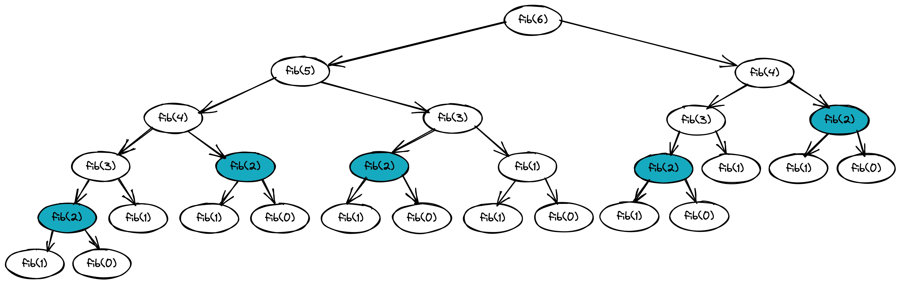

# 1. Recursion - 递归

简单地介绍完了复杂度分析，接下来就要进入算法实战了。

递归，可以说是算法学习之路上最难理解的知识点之一，很多复杂的算法实现都需要运用递归的编程技巧。

## Go - 什么是递归？

即使是科班生也很难第一时间理解透递归的思路，但其实只要将其拆开来看，递归并不难。

递归实际上只涉及两个操作，“递”和“归”。从实际生活中去理解递归：

场景一：监考老师分发试卷，由于多印了很多试卷，可以靠手去掂量，对试卷粗略分组。

要求：将多余的试卷回收给教务处。

具体步骤：

1. 将试卷发给第一排的同学，让其只能向后传；

2. 每个人只能拿一张试卷，如果没到场，留在其桌上即可；

3. 直到最后一排的同学拿到试卷后，多余的试卷将由最后一排向第一排传；

4. 传到第一排，等待监考老师来收即可。

> 这里为了帮助理解算法，我们没有让最后一排的同学直接叫老师，而是一排一排向前传

分析上述具体步骤，理解如下：

步骤 1 即递归算法的入口，试卷将一排一排的传递下去，这就是“递”；

步骤 2 即递归算法的多个子问题，下一排不管是否有人，都要留一张试卷在桌上；

步骤 3 即递归算法的终止条件，试卷传到最后一排后，则要被传回第一排，这就是“归”；

步骤 4 即递归算法的出口，在代码实现过程中，这里便回到了调用递归算法的主函数中。

以上思路的代码实现如下：

```go
// LAST :最后一排
// TOTAL :该组的分发试卷数
func rest(pos int) int {
	if pos == LAST {
		return TOTAL - 1
	}
	return rest(pos+1) - 1
}
```

## Go - 递归的三个条件

1. 可分解成多个子问题

   实现递归算法的第一件事就是将问题拆分为多个子问题，子问题即数据规模更小的问题，比如，将“试卷还剩多少”，分解为多个“下一排试卷还剩多少”的问题。

2. 子问题除数据规模不同，算法思路完全一样

   场景一中，在传递给下一排时，可以使用同一种算法思路解决子问题，如“无论是否到场，留一张试卷在桌上”。

   同样，我们可以根据不同场景更改算法思路，如场景二：不需要给没来的同学留试卷，直接传给再下一排。这样的话，算法也会跟着变化：

   ```go
   // LAST: 最后一排
   // TOTAL: 该组的分发试卷数
   // stu[]: 保存考生的到场状态，0 为未到场
   func rest(pos int) int {
       if pos == LAST {
      	    return TOTAL - 1
       }
       if stu[pos + 1] == 0 {
           if pos + 1 == LAST {
               return TOTAL - 1
           }
           return rest(pos+2) - 1
       }
       return rest(pos+1) - 1
   }
   ```

3. 存在终止条件

   推导出递归公式后，还需要找到递归的终止条件。递归之于循环一样，如果没有终止条件，算法将会无限递归下去，因此，在实现递归算法时，一定要找到合适的终止条件。

## Go - 递归的注意事项

1. 警惕内存溢出

   如果你已经开始实现递归算法了，相信你肯定碰到过这样的问题 `fatal error: stack overflow` ，这便是因为一直进行函数调用，导致栈、堆内存溢出产生的错误。

   最大允许的递归深度跟当前线程剩余的栈空间有关，不误进行事前计算，因此，这种错误很难控制和预防。

2. 警惕重复计算

   先来看看每每提到递归，就必谈的斐波那契数的实现吧：

   > Fibonacci：由 0 和 1 开始，之后的斐波那契数就是由之前的两数相加而得出，如：1, 1, 2, 3, 5, 8, 13, 21, 34, ...

   ```go
    func fib(n int) int {
    	if n == 1 {
    		return 1
    	}
    	if n == 0 {
    		return 0
    	}
        return fib(n-1) + fib(n-2)
    }
   ```

   不难发现，fib(fib(n-1)-2) 与 fib(fib(n-2)-1) 所计算的值是相同的，以 fib(6) 为例，如 Figure 1. Fibonacci 所示，fib(2) 会被计算 5 次：

    

   如果求 fib(20)，难以想象同样一个值会被重复计算多少次，因此，我们可以利用一些数据结构（如数组、散列表等）巧妙地避免这个问题：

   ```go
   // tmp[]: 存储中间值
   func fib(n int) (res int) {
       if n == 0 {
           return 0
       }
       if n == 1 {
           return 1
       }
       if tmp[n] != 0 {
           return tmp[n]
       }
       res = fib(n-1) + fib(n-2)
       tmp[n] = res
       return res
   }
   ```

   当然，为了避免重复计算，还有更加高级的方法，我提出以上方法，便是在这里抛砖引玉了。
