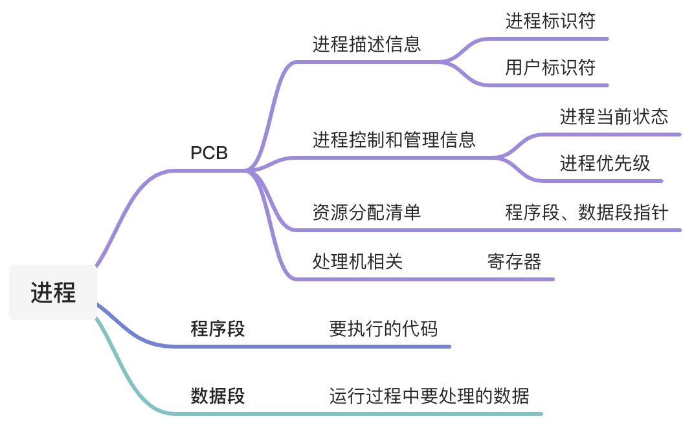
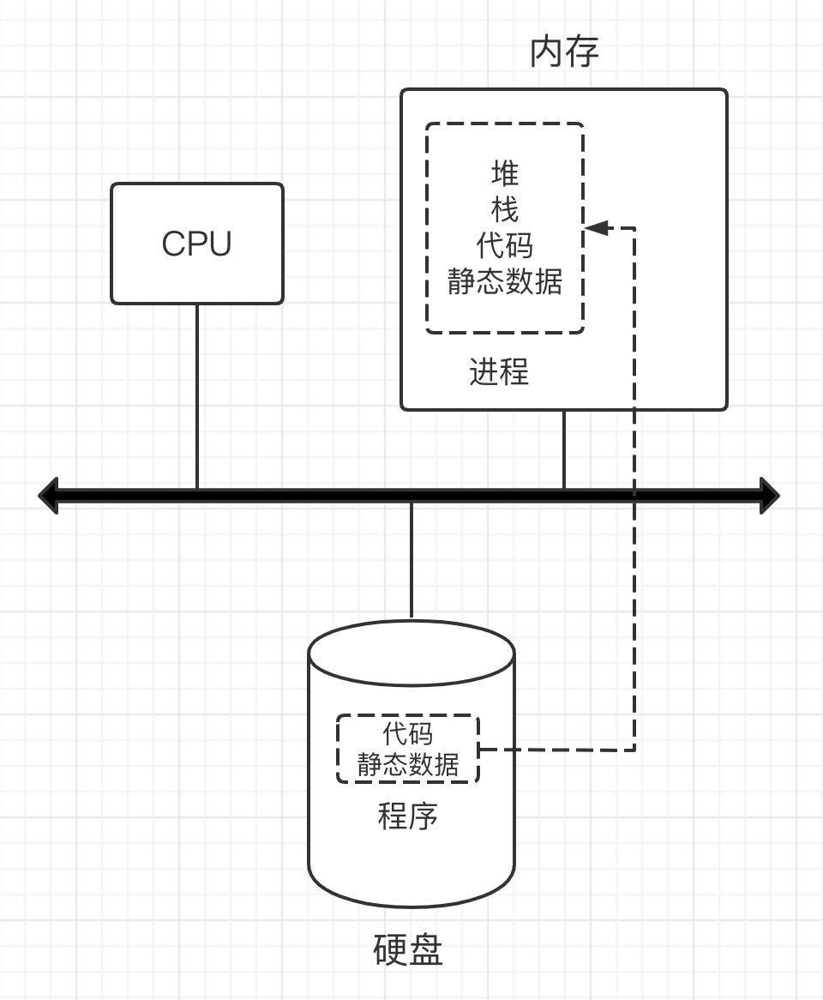
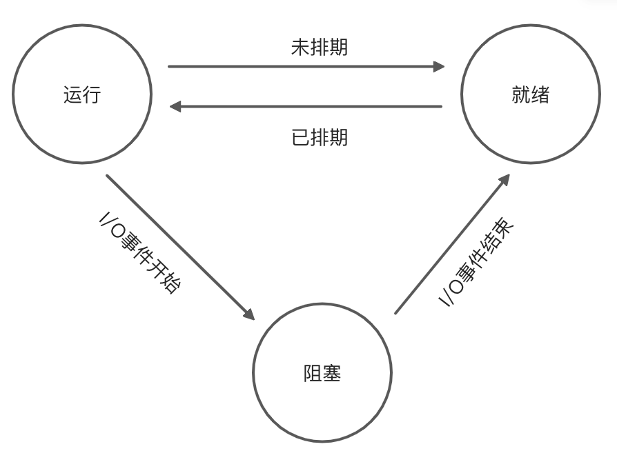

<h1>进程与进程相关的API</h1>

<strong>Abstract:</strong> 站在上层分析操作系统，分析进程，再不断深入了解其结构，熟悉其性质

## 从上层看操作系统和进程

操作系统通过虚拟化CPU的方式创造了一种多CPU的错觉：运行一个进程，终止然后运行另一个进程，这称作**CPU分时机制**，也正是为什么我们可以在操作系统上运行任意数量的并发进程。

在许多操作系统中，**常见的设计范式**是将高级策略从低级机制中抽离出来。机制即系统的运行方式，策略即与用户直接对接的解决方案。
- 操作系统直接面向用户的便是策略
- 运行中的程序可以抽象地认为是进程
- 策略决定了操作系统某一时刻运行哪个(或哪些)进程。

## 重新定义进程

我们可以根据执行过程中访问或影响的系统的不同部分来认知一个进程
- 任何时间内，包含进程状态的组件是它的内存，指令位于内存中；正在运行的程序读取和写入的数据也位于内存中。
- 因此，进程可以寻址的内存（称为其地址空间）是进程的一部分。进程状态的一部分是寄存器；许多指令显式读取或更新寄存器。

    

         
        进程组成结构
    

 

在这其中 PCB 是进程存在的唯一标志，有了大致的这样一个理解之后，我们可以重新定义一下进程：

进程是进程实体的运行过程，是系统进行资源分配和调度的一个独立单位
1. 从结构上看，每个进程都有程序段、数据段和进程控制段三个部分，所以进程具有**结构性**
2. 最前面在讲分时机制的时候，我们认识到了进程各自独立，也相互制约并且同时运行，所以进程具有**独立性、异步性、并发性**
3. 运行和终止说的是进程的生命周期，那么也说明了进程的**动态性**

## 进程是如何被创建的
我们需要思考，操作系统是如何启动并运行程序的，程序是如何转换为进程的？

    

         
        进程创建内容
    

    

         
        进程创建流程
    

 

这里我画了一张图给大家，过程以及加载传递的内容非常详细，但其中有一个需要注意的点就是：
- 简单的操作系统，或者说原始的操作系统，对于将代码和静态数据加载到内存中这一操作是一次性完成的
- 现代操作系统大多通过懒加载的方式，程序执行期间才会加载，这一过程可以在后续的分页和交换机制内容中得到一个详细的解释

## 进程的状态
> 在上述的流程中，进程被创建，那么在给定的时间段内，进程所处的状态是何种情况呢？

简单来说，进程有**运行**、 **就绪**、**阻塞**三种状态：
- 进程正在处理机上运行。在单处理机环境下，每一时刻最多只有一个进程处于运行状态。
- 进程已处于准备运行的状态，即进程获得了除处理机之外的一切所需资源，一旦得到处理机即可运行。
- 又称等待状态：进程正在等待某一事件而暂停运行，如等待某资源为可用（不包括处理机）或等待输入/输出完成。即使处理机空闲，该进程也不能运行。

    

         
        进程状态转换
    

 

## 进程相关API
> 这里所介绍的 API 应用在各大现代操作系统中

1. 创建
- 所有的操作系统均包含有创建新进程的方法，我们通过shell命令或者GUI操作打开新的应用程序，都是操作系统在调用创建的 API 在创建新的进程
2. 销毁
- 当然通常情况下进程在运行完成时会自动销毁，但是操作系统还提供了销毁进程的 API，在 Windows 系统上结束进程或者在 Mac 系统上强制退出都属于这种调用
3. 等待
- 举个例子，有时候我们有一种诉求，希望等待某个进程执行完成之后再执行新的进程，操作系统便提供了进程等待的 API
4. 其他控制方式
- 为满足用户需求，除了上述三种控制还需要别的一些控制方式，例如大多数的操作系统都可以暂停正在执行的进程，也可以恢复暂停中的进程
5. 状态
- 通常还有一些接口来获取进程的一些状态信息，例如运行了多长时间，或者正处于什么状态

## 策略层-操作系统如何管理
> 和我们所看到的程序一样，操作系统也是一种特殊的程序，它也会通过一些数据结构来跟踪各种各样的信息
- 为了跟踪每个进程的状态，操作系统可能会保留所有处于就绪状态的进程列表以及一些附加信息来跟踪当前正在运行的进程
- 当 I/O 事件结束时，操作系统应确保唤醒正确的进程并准备好再次运行
- 对于终止的进程，寄存器上下文将保存其寄存器的内容。当一个进程终止后，它的寄存器会被保存到这个内存位置；通过恢复这些寄存器，操作系统可以恢复运行该进程。